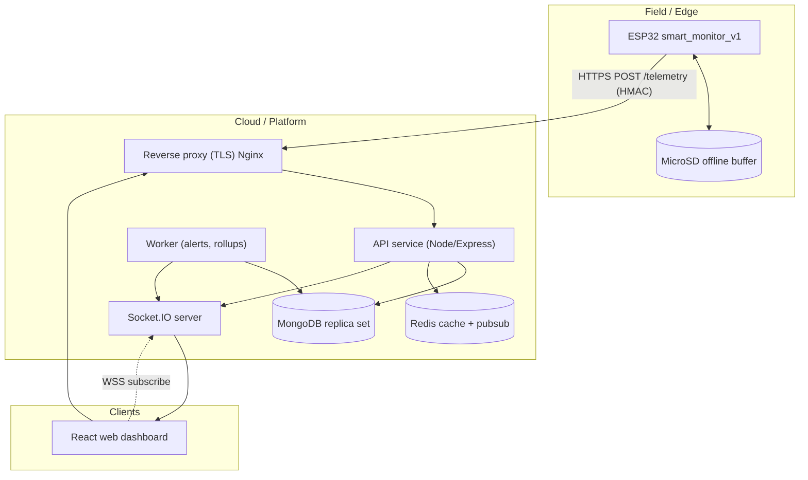
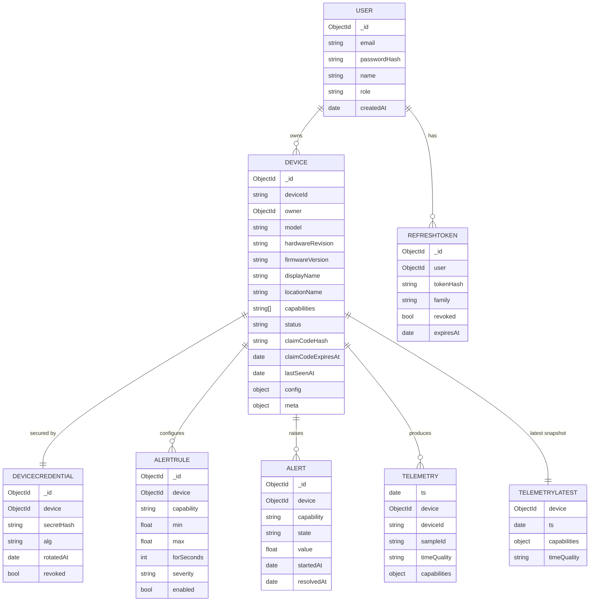
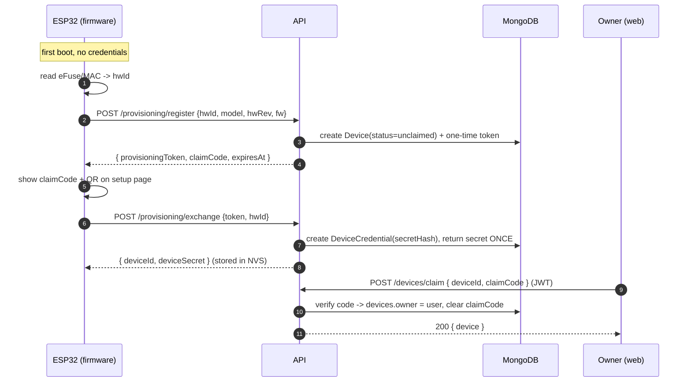
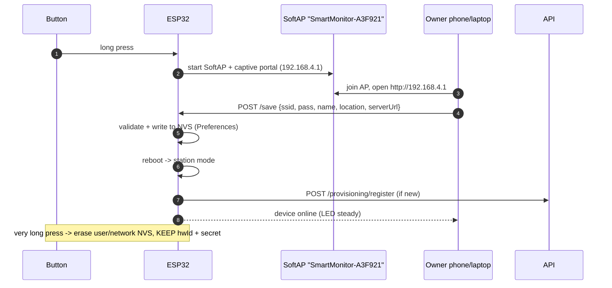
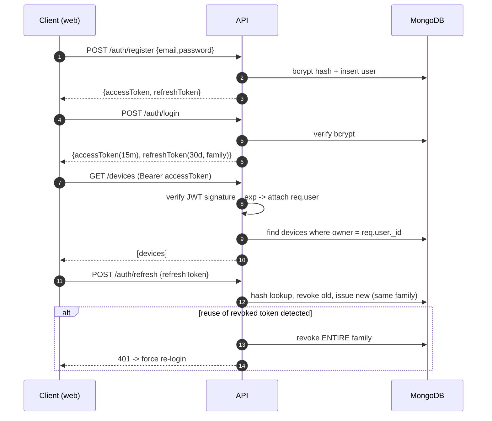

# SMART MONITOR V1 — Architecture & Design Document

> **Product (mn):** Ухаалаг орчны мониторингийн станц
> **Product code:** `smart_monitor_v1`
> **Scope:** Sections 1–26 (prompt §40), produced *before* implementation.
> **Status:** Draft for approval → implemented phase-by-phase.

---

## 1. Complete System Analysis

### 1.1 What the product is

`smart_monitor_v1` is the **first model of a product family**. It is *not* a demo dashboard.
Its primary unit is a self-owned ESP32 monitoring station that measures environmental values,
stores them locally when the network fails, and delivers them to a cloud backend that is
**agnostic to the exact sensor set**.

### 1.2 The five fundamental separations

The design is driven by keeping these concepts decoupled (prompt §42):

| Concept | Lives in | Never mixed with |
|---|---|---|
| **Hardware identity** | ESP32 eFuse/MAC + backend UUID | user ownership |
| **User ownership** | `devices.owner` | authentication |
| **Configuration** | NVS on device + `devices.config` | identity |
| **Telemetry** | time-series collection | configuration |
| **Authentication** | `devicecredentials` (HMAC) + JWT (users) | identity string |

Consequence: renaming a device, moving it between owners, changing Wi-Fi, or changing the
sensor set **must not** invalidate identity or telemetry.

### 1.3 Why a capability model drives everything

If the backend "knows" that `temperature` comes from a DHT11 on GPIO4, then `v2`, `agriculture`,
`industrial`, `air`, `weather` each require a backend redesign. Therefore:

* Devices declare **`capabilities[]`** (semantic measurement names).
* Telemetry is a **map of capability → reading object**, not a fixed table.
* The dashboard renders widgets **from capabilities**, never from hard-coded sensor names.

### 1.4 Product-family expansion path

```
smart_monitor_v1          (DHT11, BMP180, BH1750, CCS811, A3144, MicroSD)   <- now
smart_monitor_v2          new MCU / sensors, same API contract
smart_monitor_agriculture + soil_moisture, rainfall, solar_radiation
smart_monitor_greenhouse  + co2 (NDIR), PAR light, humidity control
smart_monitor_cellar      + co2, voc, temp gradient
smart_monitor_industrial  + pm1/2.5/10, noise, co
smart_monitor_air         + pm, no2, so2, o3
smart_monitor_weather     + wind direction, rainfall, uv_index
```

**Hard rule:** adding a model = adding a *provisioning profile* (capability names + calibration
defaults) + firmware. **No schema migration, no backend redeploy required.**

### 1.5 Current proven baseline (V1)

DHT11 -> `temperature`,`humidity`; BMP180 -> `temperature`,`pressure`;
BH1750 -> `illuminance`; CCS811 -> `eco2`,`tvoc`; A3144 -> `wind_rpm`,`wind_speed`.
MicroSD = local offline buffer. **RTC is NOT used.**

---

## 2. Assumptions

1. ESP32 has no RTC; time quality is `ntp` (trusted), `synced` (last NTP + monotonic uptime),
   or `estimated` (never NTP-synced since boot) -> recorded as `timeQuality` on every sample.
2. A device may be **offline for long periods**; the MicroSD buffer must survive power loss and
   is drained **at-least-once** (dedup server-side via `sampleId`).
3. Devices reach the backend over Wi-Fi/Internet; MongoDB is **never** exposed to devices.
4. TLS (HTTPS/WSS) terminates at a reverse proxy in production; devices use `https://`.
5. A user may own many devices; a device has exactly one owner (transfer supported).
6. `eCO2` from CCS811 is a **calculated equivalent**, never presented as NDIR `co2` (prompt §42).
7. Backend is horizontally scalable (stateless HTTP); Socket.IO uses a Redis adapter in prod.
8. Server clock is authoritative; device skew tolerated up to `DEVICE_MAX_CLOCK_SKEW_S`.
9. Firmware is **non-blocking** (cooperative scheduler); no `delay()` in the main loop.
10. Sensor failure is isolated: one dead sensor degrades only its own capability.

---

## 3. Functional Requirements

### FR-A Authentication & Accounts
- FR-A1 Email+password registration, bcrypt-hashed (cost >= 12).
- FR-A2 Short-lived access JWT + rotating refresh token.
- FR-A3 Refresh rotation with reuse detection -> revoke whole token family on replay.
- FR-A4 Roles `owner` / `admin` / `manager` / `viewer`, enforced server-side (never
  frontend-only). The vocabulary lives in `utils/roles.js` and is shared by the
  HTTP middleware, the service layer and the Socket.IO room guard.
- FR-A5 Self-registration can only ever create an `owner`. The first privileged
  accounts come from the server environment (`BOOTSTRAP_*`), applied idempotently
  on every boot; every later account is created by an admin through
  `POST /auth/users` (threat T17).

### FR-B Device provisioning & identity
- FR-B1 Firmware **never** hard-codes Wi-Fi credentials.
- FR-B2 If unprovisioned -> SoftAP `SmartMonitor-<6hex>` with captive setup flow.
- FR-B3 Owner configures SSID, password, display name, location, server endpoint.
- FR-B4 Device exchanges a one-time **provisioning token** for `deviceId` + `deviceSecret`
  (secret shown once, stored in NVS).
- FR-B5 Secret stored server-side as a **hash** (never plaintext).
- FR-B6 Factory reset removes user/network config but **preserves** identity + secret.
- FR-B7 Short / long / very-long button press = user action / provisioning / factory reset.
- FR-B8 SoftAP -> BLE provisioning migration path (transport kept abstract).

### FR-C Claiming
- FR-C1 Unclaimed device shows rotating `claimCode` and QR `SMV1:<deviceId>:<claimCode>`.
- FR-C2 Logged-in user claims it -> `devices.owner = user`, `claimCode` invalidated.
- FR-C3 `deviceId` alone **cannot** authorize submission (prompt §42) — only HMAC works.
- FR-C4 Claim idempotent + rate-limited; wrong codes lock out.

### FR-D Telemetry ingestion
- FR-D1 `POST /api/v1/telemetry` accepts a **batch** of samples.
- FR-D2 Batch signed `HMAC-SHA256(deviceSecret, method|path|timestamp|nonce|bodyHash)`.
- FR-D3 Headers `X-Device-Id`, `X-Timestamp`, `X-Nonce`, `X-Body-SHA256`, `X-Signature`.
- FR-D4 Replay protection: nonce cache + timestamp window.
- FR-D5 Sample = `capability -> { value, unit, quality, source }`; failed sensor **omitted**,
  never `0` (prompt §42).
- FR-D6 Samples carry device-generated `sampleId` for idempotent dedup.
- FR-D7 Response `202 { accepted, duplicates, rejected }`.
- FR-D8 Device ACK means "durably accepted" -> only then firmware clears the SD record.

### FR-E Query & realtime
- FR-E1 `GET /api/v1/telemetry/:deviceId?from&to&capability&bucket`.
- FR-E2 Aggregated buckets (raw/minute/hour/day) for chart performance.
- FR-E3 `GET /api/v1/telemetry/:deviceId/latest`.
- FR-E4 Socket.IO rooms `device:<id>` and `user:<id>` for live push.
- FR-E5 Ownership enforced on **every** read.

### FR-F Alerts
- FR-F1 Threshold rules per device+capability (`min`, `max`, `forSeconds`, severity).
- FR-F2 Evaluated on ingest; state machine `ok -> pending -> firing -> resolved` (anti-flap).
- FR-F3 Emits `alert:raised` / `alert:resolved` over Socket.IO.

### FR-G Device management
- FR-G1 List / inspect / rename / locate devices.
- FR-G2 Rotate `deviceSecret`.
- FR-G3 View last-seen, firmware version, capabilities, time quality, SD backlog.
- FR-G4 Transfer / revoke ownership.

### FR-H Offline -> online sync
- FR-H1 Firmware buffers samples to MicroSD as append-only newline-delimited JSON.
- FR-H2 On reconnect, drains chronologically, chunked, with retry/backoff.
- FR-H3 Server dedups by `(device, sampleId)`; firmware deletes only **after** ACK.

---

## 4. Non-Functional Requirements

| Area | Target |
|---|---|
| Scalability | 1e4 devices, aim 1e5; stateless API + replica set + Redis adapter |
| Ingest latency | p95 < 250 ms for a 60-sample batch (single node) |
| Availability | 99.5% API; device tolerates 100% cloud outage via SD buffer |
| Durability | `w:majority` telemetry writes; no loss on Wi-Fi failure (prompt §42) |
| Security | TLS-only, HMAC device auth, JWT users, bcrypt, helmet, rate-limit, no secrets in git/firmware |
| Maintainability | Feature-sliced frontend, service-layer backend, capability abstraction |
| Observability | JSON logs w/ requestId, `/health`, `/metrics` (Prometheus-ready) |
| Portability | `docker-compose up` -> Mongo + Redis + API + web |
| Firmware | No blocking delays; per-sensor isolation; < 100 ms loop tick |
| Extensibility | New capability = 1 registry entry, zero migrations |

---

## 5. Actors and Permissions

| Actor | Description | Permissions |
|---|---|---|
| Guest | Unauthenticated | register, login, marketing page |
| Owner | Registered user who claimed a device | full CRUD on *own* devices, read own telemetry, manage alert rules |
| Manager | Fleet operator | read **every** device, tune settings + alert rules, rotate secrets, transfer; **never** revoke/delete a device, **never** manage accounts |
| Admin | Platform operator | read all, revoke/delete devices, create and promote accounts |
| Viewer | Read-only collaborator (V1 placeholder) | read a shared device |
| Device | ESP32 firmware | `telemetry:write` (own), `config:read` (own) |
| Provisioning client | Device in first-boot mode | `provision:register` (one-time token) |

**Device role is denied everything a user role has** — HMAC device credentials can never read
another device; user JWTs can never submit telemetry.

**A non-owner is refused with 404, never 403** — otherwise the error itself
enumerates which device ids exist (threat T22). A real 403 is reserved for a
*known* caller attempting an action its role forbids (e.g. a manager calling
`DELETE /devices/:id`).

**Role changes take effect immediately** — `authenticate` re-reads the account
from MongoDB on every request, so downgrading a role revokes the privilege even
for an access token that is still valid (threat T17). The frontend nav/route
guards are presentation only and grant no authority whatsoever.

---

## 6. Use Cases

| ID | Actor | Use case | Precondition | Main flow |
|---|---|---|---|---|
| UC-01 | Owner | Register / Login | none | email+pass -> JWT pair -> dashboard |
| UC-02 | Owner | Provision device | device in SoftAP | join AP -> setup form -> save to NVS -> reboot |
| UC-03 | Device | Self-register | internet + provisioning token | POST /provisioning/exchange -> deviceId+secret |
| UC-04 | Owner | Claim device | logged in, device shows code | enter code / scan QR -> device appears |
| UC-05 | Device | Submit telemetry | valid HMAC | POST /telemetry (batch) -> 202 -> clear SD |
| UC-06 | Device | Drain backlog | reconnected | read SD oldest-first -> batch -> retry on failure |
| UC-07 | Owner | View live data | owns device | open device page -> WSS subscribe -> live charts |
| UC-08 | Owner | View history | owns device | date range -> aggregated buckets -> charts |
| UC-09 | Owner | Configure alerts | owns device | set min/max/forSeconds -> rule stored |
| UC-10 | System | Raise alert | sample breaches rule | state machine -> `alert:raised` |
| UC-11 | Owner | Rename / locate device | owns device | PATCH -> `device:updated` |
| UC-12 | Owner | Rotate secret | owns device | POST /rotate -> new secret issued once |
| UC-13 | Admin | Revoke device | admin | device blacklisted; HMAC rejected |
| UC-14 | Device | Recover time | NTP lost | mark `timeQuality=estimated`, keep sampling |
| UC-15 | System | Bootstrap first admin | fresh deployment, `BOOTSTRAP_*` set | boot -> account ensured idempotently |
| UC-16 | Admin | Create an operator account | admin signed in | POST /auth/users(role) -> account signs in itself |
| UC-17 | Manager | Watch the whole fleet | manager signed in | device list spans every owner; destructive actions 403 |

---

## 7. Overall Architecture



**Rules encoded above**
* MongoDB is reachable only from `API`/`WK` — never from devices (prompt §42).
* Devices carry their own offline durability (`MicroSD`), so a cloud outage loses nothing.
* Redis enables horizontal scale (nonce cache, rate-limit, Socket.IO fan-out).

---

## 8. ESP32 Architecture

### 8.1 Layered firmware

```
+--------------------------------------------------------------+
| setup()/loop()  -- cooperative, non-blocking scheduler        |
+--------------------------------------------------------------+
| Application services                                          |
|  Sampler | Uploader | SDBuffer | Provisioning | Config | LED   |
+--------------------------------------------------------------+
| Drivers (one per capability, isolated, non-fatal)             |
|  Dht11 | Bmp180 | Bh1750 | Ccs811 | Anemometer(A3144)          |
+--------------------------------------------------------------+
| HAL / Buses                                                   |
|  I2C (SDA21,SCL22) | SPI (CS5,SCK18,MISO19,MOSI23)            |
|  GPIO4 (DHT)       | GPIO16 pulse (anemometer)                 |
+--------------------------------------------------------------+
| Arduino core / ESP-IDF: WiFi, SNTP, Preferences(NVS), HTTP, JSON |
+--------------------------------------------------------------+
```

### 8.2 Non-blocking scheduler

Every task is a **state machine polled** from `loop()` with a `lastRun` timestamp:

| Task | Period | Notes |
|---|---|---|
| `sensorPoll` | 2000 ms | reads all sensors; per-sensor isolated |
| `aggregate` | 60000 ms | one sample with all available capabilities |
| `sdFlush` | sample + 5000 ms | append JSONL; drain when online |
| `netCheck` | 5000 ms | WiFi, SNTP, reconnect w/ backoff |
| `heartbeat` | 30000 ms | firmware, rssi, timeQuality, backlog |
| `buttonScan` | 50 ms | short / long / very-long detection |
| `serialCmd` | 50 ms | debug shell |

No `delay()`; the loop must stay under 100 ms per tick.

### 8.3 Sensor isolation contract

```cpp
struct SensorReading {
  bool        valid;
  double      value;
  const char* unit;
  const char* quality;   // "ok" | "low" | "calibrating" | "error"
};
```

A driver returning `valid == false` contributes **no** capability to the sample. It never writes
`0.0` and never aborts the cycle (prompt §42). Repeated failures set a `sensor:down` flag that is
reported in the heartbeat.

### 8.4 Time strategy (no RTC)

* Boot: try SNTP (`pool.ntp.org`) -> `timeQuality = "ntp"`.
* NTP unavailable but synced earlier this power cycle -> `"synced"` (millis offset).
* Never synced -> `"estimated"` (last known config time + uptime), still recorded.
* Every sample carries `ts` + `timeQuality`; the server stores both and never silently treats an
  `estimated` timestamp as authoritative.

### 8.5 Anemometer calibration

```cpp
float windCalibrationCoef;      // m/s per rotation-per-second; default 1.0 == UNCALIBRATED
const int PULSES_PER_ROTATION = 1;
```

* A3144 pulses on GPIO16 via ISR -> `pulses` -> `rotations = pulses / PULSES_PER_ROTATION`.
* `rps = rotations / windowSeconds`; `wind_speed = rps * windCalibrationCoef`.
* `wind_rpm` is always reported **raw**; `wind_speed` is only meaningful after calibration.
* Calibration procedure documented in `docs/hardware/WIRING.md`.

---

## 9. Backend Architecture

### 9.1 Layered request flow

```
HTTP request
  -> helmet / cors / json / requestId   (config/app.js)
  -> rate limiter                       (middleware/rateLimit)
  -> route                              (routes/*.routes.js)
  -> validator (Zod)                    (validators/*.js)
  -> authN: JWT (users) OR HMAC (devices)
  -> authZ / ownership                  (middleware/ownership)
  -> controller (thin: parse -> service)
  -> service    (business logic + DB)
  -> model      (Mongoose schema + indexes)
  -> response envelope { success, data, meta }
```

### 9.2 Modules

| Module | Responsibility |
|---|---|
| `auth` | register, login, refresh rotation, logout, me |
| `device` | list / get / patch / claim / transfer / rotate / revoke |
| `provisioning` | issue one-time tokens, exchange for credentials |
| `telemetry` | batch ingest (signed), query raw, aggregate, latest |
| `alert` | rule CRUD + evaluation on ingest |
| `status` | device heartbeat: liveness, backlog, firmware, rssi |
| `socket` | rooms, auth handshake, event fan-out |

### 9.3 Ingest pipeline (hot path)

```
1. verify HMAC (X-Device-Id, ts, nonce, bodyHash)   -> 401 on mismatch
2. nonce replay check (Redis SET NX EX ttl)         -> 409 on replay
3. validate batch schema (Zod)                      -> 422 on bad shape
4. expand samples -> {device, ts, timeQuality, capabilities{}, sampleId}
5. idempotent write, ignoring duplicate (device, sampleId)
6. update telemetry_latest (one doc per device)
7. update devices.lastSeenAt, firmware, rssi, meta
8. publish -> Redis -> Socket.IO `telemetry:new`
9. evaluate alert rules -> `alert:raised` / `alert:resolved`
10. respond 202 { accepted, duplicates, rejected }
```

Steps 8–9 are async so the ACK is never delayed by fan-out failures.

### 9.4 Scaling

* Stateless API behind LB; JWT/HMAC verification is local (no session store).
* Socket.IO Redis adapter for cross-instance rooms.
* Time-series collection with `metaField: device`, bucketed `timeField: ts`.
* Rollup worker builds `minute`/`hour`/`day` documents for cheap long-range charts.

---

## 10. Frontend Architecture

### 10.1 Feature-sliced structure

```
web/src
├── api/          axios client + endpoint modules (auth, devices, telemetry)
├── components/   presentational (Card, Sparkline, StatTile, Badge, Modal)
├── features/     auth | devices | telemetry (feature-owned components + hooks)
├── hooks/        useSocket, useTelemetry, useAuth, useDebounce
├── layouts/      AppLayout (nav + <Outlet/>)
├── pages/        Login, Register, Dashboard, Devices, DeviceDetail, Settings
├── stores/       zustand: authStore, deviceStore, uiStore
└── utils/        formatters + capability registry (labels/units/colors)
```

### 10.2 Capability-driven rendering

`utils/capabilities.js` maps `temperature -> {label, unit, icon, color, decimals}`. Widgets are
generated from `device.capabilities`, so a `v2` / `agriculture` device renders automatically with
**no** frontend change.

### 10.3 Realtime

* `useSocket` connects with the access token, joins `user:<id>` and `device:<id>`.
* `telemetry:new` merges into a bounded ring buffer powering live charts.
* Automatic reconnect + resubscribe after token refresh.

---

## 11. MongoDB Schema (ER)



### 11.1 Key indexes & invariants

* `users.email` — unique.
* `devices.deviceId` — unique; `devices.owner` — indexed; `devices.claimCodeHash` — indexed sparse.
* `telemetry` — **time-series** on `ts`, `metaField: device`; unique compound `{device, sampleId}`
  for dedup; TTL option (e.g. 400 days) for raw retention.
* `telemetrylatest.device` — unique.
* `refreshTokens.tokenHash` — unique; TTL index on `expiresAt`.
* `alerts` — compound `{device:1, capability:1, state:1}`.
* Cascade deletes (device -> telemetry/latest/rules/alerts) are handled in the service layer and
  documented in `docs/api/API.md`.

---

## 12. Time-Series Strategy

| Layer | Resolution | Retention | Purpose |
|---|---|---|---|
| `telemetry` (raw) | as sent | 90–400 d (TTL / bucket maxSpan) | audit, export, recalculation |
| `telemetry_minute` | 1 min | 2 y | short-range charts |
| `telemetry_hour` | 1 h | 5 y | medium-range charts |
| `telemetry_day` | 1 d | forever | long-range trends |
| `telemetrylatest` | latest only | forever | dashboard tiles, alert eval |

Mechanics:
* Raw collection created as `timeseries: { timeField: 'ts', metaField: 'device', granularity: 'seconds' }`.
* Aggregation pipelines use `$group` on `$dateTrunc` for on-demand buckets; the rollup worker
  precomputes the coarse collections so dashboards never scan raw data.
* `bucket=raw|minute|hour|day` query parameter chooses the collection.
* Each bucket document stores `{count, min, max, avg, first, last}` per capability so charts can
  render bands, not just lines.

---

## 13. Device Identity & Claiming Flow



**Invariants**
* `deviceId` = `SMV1-<12 hex>` derived from a backend-generated random UUID (stored), never sequential.
* `deviceId` is **public**; it authenticates nothing.
* `deviceSecret` exists in plaintext only in device NVS and in the one-time exchange response.
* Reclaiming a lost device requires admin action (proof of physical possession = claimCode rotation).

---

## 14. Wi-Fi Provisioning Flow



* Credentials are **never** compiled into firmware (prompt §42).
* Wi-Fi can be changed later by re-entering provisioning mode — no reflash.
* Factory reset preserves immutable hardware identity.
* Transport is abstracted (`ProvisioningTransport`) so a BLE implementation can replace SoftAP.

---

## 15. Authentication / Authorization Flow



Authorization matrix (server-enforced):

| Endpoint class | Guest | Owner(JWT) | Admin | Device(HMAC) |
|---|---|---|---|---|
| `/auth/*` | yes | yes | yes | no |
| `/devices` (list/create) | no | own | all | no |
| `/devices/:id` read | no | own only | all | own only |
| `/devices/:id` write | no | own only | all | no |
| `/telemetry` POST | no | no | no | yes (own) |
| `/telemetry/:id` GET | no | own only | all | no |

---

## 16. Offline -> Online Synchronization Flow

```mermaid
sequenceDiagram
  autonumber
  participant S as Sensors
  participant F as ESP32
  participant SD as MicroSD (JSONL)
  participant A as API

  loop every sample interval
    S->>F: readings (per-sensor isolated)
    F->>SD: append {sampleId, ts, timeQuality, capabilities}
    Note over F: buffer is source of truth while offline
  end

  F->>A: (WiFi up) POST /api/v1/telemetry {samples:[...]}
  alt 202 Accepted
    A-->>F: { accepted, duplicates, rejected }
    F->>SD: delete acknowledged records (only those)
  else network error / 5xx
    A-->>F: failure
    Note over F: exponential backoff 2s..60s, retry same chunk
  end
  Note over F,A: at-least-once delivery; server dedups by (device, sampleId)
```

* Failure never loses telemetry (prompt §42).
* Chunk size bounded (`SYNC_BATCH_MAX`) to fit device RAM.
* Chronological drain keeps time-series monotonic per device.

---

## 17. MicroSD Strategy

**Layout**

```
/buffer/
   pending.ndjson     <- append-only queue of unsent samples (1 JSON object per line)
   pending.idx        <- optional: byte-offset index for O(1) head reads
   sealed/seg-0001.ndjson   <- rotated segments once > N records (bounded file size)
/log/
   boot.log
/config/backup.json  <- non-secret config backup (never stores deviceSecret)
```

**Rules**
* Append with `flush()` after each write; power loss loses at most the in-flight record.
* Rotation: seal current segment at `SD_SEGMENT_MAX` records, open `seg-000N+1`.
* Drain advances a **read cursor**; records are only deleted/compacted after a `202` ACK.
* Corruption recovery: if a line fails JSON parse, skip it, log a `sd:corrupt` counter, continue.
* When the card is full (`low < 5%`), firmware raises `sd:full` status and stops appending —
  it never deletes unsent data to make room.
* Card removal must not crash the firmware: remount attempts are throttled and non-blocking.

---

## 18. Anemometer Calibration Strategy

**Physical chain:** wind cups -> rotating shaft -> A3144 Hall sensor -> GPIO16 pulses.

**Measurements reported**
| Capability | Meaning | Calibrated? |
|---|---|---|
| `wind_rpm` | raw shaft rpm = `rotations/window * 60` | always valid |
| `wind_speed` | `rps * windCalibrationCoef` | only after calibration |

**Calibration procedure (documented + partially automated)**
1. Provide a known reference (handheld anemometer, or the datasheet transfer curve).
2. Steady wind, measure for `T = 60 s`; record `rotations` and reference `v_ref` (m/s).
3. `coef = v_ref / (rotations / T)`  [m/s per rps].
4. Repeat at 3+ speeds (e.g. 2, 5, 10 m/s); fit a linear `v = a*rps + b` if curvature is
   significant; store `a` and `b` (V1 stores the single-coefficient `windCalibrationCoef`).
5. Persist to NVS (`anemo.coef`); the value is **configurable, never hard-coded** (prompt §42).
6. While `coef == 1.0` (default), firmware marks `wind_speed.quality = "uncalibrated"` so the UI
   can warn instead of showing a fake number.

**Pulse handling**
* ISR increments a volatile counter only (no logic inside the ISR).
* `PULSES_PER_ROTATION` is configurable (magnet count).
* Debounce window to reject contact bounce.

**Why not a fixed constant:** a hard-coded `m/s = rpm * k` silently produces wrong data for every
different cup geometry; calibrated + quality-flagged is the only honest approach.

---

## 19. Security Threat Analysis

| # | Threat | Vector | Mitigation |
|---|---|---|---|
| T1 | Device impersonation | attacker submits telemetry as another device | HMAC-SHA256 per request w/ `deviceSecret`; `deviceId` alone never authorizes (FR-C3) |
| T2 | Replay attack | capture and resend a valid signed request | `X-Nonce` + `X-Timestamp`; server rejects nonce reuse and skew beyond window |
| T3 | Secret theft from DB | DB dump | store **bcrypt hash** of secret; plaintext exists only in device NVS |
| T4 | Secret theft in transit | MITM | TLS-only; HSTS; HMAC still binds method/path/body |
| T5 | Credential stuffing | login abuse | bcrypt cost 12, per-IP + per-account rate limit, lockout, generic error messages |
| T6 | JWT theft (XSS) | malicious script | access token short TTL + refresh rotation; refresh stored httpOnly in web (or memory + rotation); strict CSP |
| T7 | Refresh replay | stolen refresh token reused | rotation + family revocation on reuse detection (FR-A3) |
| T8 | IDOR | user reads another owner's device | ownership check in `ownership` middleware on **every** route (FR-E5) |
| T9 | Frontend-only authZ | client hides buttons only | all authorization decisions server-side (prompt §42) |
| T10 | Direct DB exposure | open Mongo port | Mongo bound to private network; never internet-facing (prompt §42) |
| T11 | Unclaimed device hijack | attacker claims first | short-lived rotating `claimCode` + lockout + admin reclaim path |
| T12 | Firmware secret extraction | flash dump | NVS encryption (Flash Encryption) + Secure Boot on production units |
| T13 | Wi-Fi creds leaked | hard-coded in repo | never compiled in; runtime NVS only (prompt §42) |
| T14 | DoS on ingest | flood signed/unenforced requests | rate limit per device + global; cheap HMAC-before-parse; body size cap |
| T15 | Malicious payload | oversized/deep JSON | `express.json({limit:'256kb'})`, Zod schema, no eval, no dynamic keys |
| T16 | Telemetry poisoning | absurd sensor values | server range validation per capability; out-of-range -> `rejected`, flagged |
| T17 | Privilege escalation | role tampering | role stored in DB, embedded in JWT, re-checked for admin actions |
| T18 | Dependency CVEs | supply chain | pinned versions, `npm audit` in CI |
| T19 | Log leakage | secrets in logs | redaction middleware; never log Authorization/signature/secret |
| T20 | Clock skew abuse | forged timestamps | server timestamps authoritative; skew capped; `timeQuality` recorded |
| T21 | SD tampering | physical access | buffer is untrusted input: validated by the same Zod schema server-side |
| T22 | Enumeration of devices | probing `/devices/:id` | opaque ObjectId + deviceId not sequential + rate limit + uniform 404 |

---

## 20. API Specification

Base URL: `/api/v1`. Response envelope: `{ success, data, meta? }` / errors `{ success:false, error:{ code, message, details? } }`.

### 20.1 Auth (public + JWT)

| Method | Path | Auth | Body / Query | Response |
|---|---|---|---|---|
| POST | `/auth/register` | – | `{email,password,name}` | `201 {user, accessToken, refreshToken}` |
| POST | `/auth/login` | – | `{email,password}` | `200 {user, accessToken, refreshToken}` |
| POST | `/auth/refresh` | refresh | `{refreshToken}` | `200 {accessToken, refreshToken}` |
| POST | `/auth/logout` | JWT | `{refreshToken}` | `204` |
| GET | `/auth/me` | JWT | – | `200 {user}` |

### 20.2 Device provisioning (device-side, no JWT)

| Method | Path | Auth | Body | Response |
|---|---|---|---|---|
| POST | `/provisioning/register` | – (rate-limited) | `{hwId, model, hardwareRevision, firmwareVersion, capabilities[]}` | `201 {deviceId, provisioningToken, claimCode, expiresAt}` |
| POST | `/provisioning/exchange` | provisioning token | `{provisioningToken, hwId}` | `201 {deviceId, deviceSecret, mqtt?}` |
| POST | `/provisioning/heartbeat` | HMAC | `{firmwareVersion, rssi, uptime, timeQuality, backlog, sensors}` | `200 {ok, serverTime}` |

### 20.3 Devices (user-side, JWT)

| Method | Path | Auth | Body / Query |
|---|---|---|---|
| GET | `/devices` | JWT | `?status&page&limit` |
| GET | `/devices/:deviceId` | JWT (own/admin) | – |
| POST | `/devices/claim` | JWT | `{deviceId, claimCode}` |
| PATCH | `/devices/:deviceId` | JWT (own) | `{displayName?, locationName?, config?}` |
| POST | `/devices/:deviceId/rotate-secret` | JWT (own) | – -> `{deviceSecret}` once |
| POST | `/devices/:deviceId/transfer` | JWT (own) | `{toEmail}` |
| DELETE | `/devices/:deviceId` | JWT (own)/admin | – (unclaim / soft-delete) |

### 20.4 Telemetry

| Method | Path | Auth | Notes |
|---|---|---|---|
| POST | `/telemetry` | **HMAC device** | batch ingest -> `202 {accepted, duplicates, rejected}` |
| GET | `/telemetry/:deviceId` | JWT (own) | `?from&to&capability&bucket=raw\|minute\|hour\|day&limit` |
| GET | `/telemetry/:deviceId/latest` | JWT (own) | latest snapshot |

**Signed request headers**

```
X-Device-Id:   SMV1-A1B2C3D4E5F6
X-Timestamp:   1735689600            (unix seconds; must be within DEVICE_MAX_CLOCK_SKEW_S)
X-Nonce:       550e8400-e29b-41d4    (uuid; single use)
X-Body-SHA256: <hex sha256 of raw body>
X-Signature:   <hex hmac-sha256(deviceSecret, canonicalString)>
canonicalString = METHOD + "\n" + PATH + "\n" + X-Timestamp + "\n" + X-Nonce + "\n" + X-Body-SHA256
```

**Ingest body**

```json
{
  "firmwareVersion": "1.0.0",
  "hardwareRevision": "1.0",
  "capabilities": ["temperature","humidity","pressure","illuminance","eco2","tvoc","wind_rpm","wind_speed"],
  "samples": [
    {
      "sampleId": "SMV1-A1B2C3D4E5F6-0000000042",
      "ts": "2026-02-10T09:15:00.000Z",
      "timeQuality": "ntp",
      "capabilities": {
        "temperature": { "value": 21.4, "unit": "C",  "quality": "ok", "source": "dht11" },
        "humidity":    { "value": 47.0, "unit": "%",  "quality": "ok", "source": "dht11" },
        "pressure":    { "value": 99812, "unit": "Pa", "quality": "ok", "source": "bmp180" },
        "illuminance": { "value": 134.0, "unit": "lx", "quality": "ok", "source": "bh1750" },
        "eco2":        { "value": 612,   "unit": "ppm","quality": "calibrating", "source": "ccs811" },
        "tvoc":        { "value": 88,    "unit": "ppb","quality": "ok", "source": "ccs811" },
        "wind_rpm":    { "value": 96.5,  "unit": "rpm","quality": "ok", "source": "a3144" },
        "wind_speed":  { "value": 3.1,   "unit": "m/s","quality": "uncalibrated", "source": "a3144" }
      }
    }
  ]
}
```

Status codes: `200` ok, `201` created, `202` accepted, `204` no content, `400` bad request,
`401` unauthenticated, `403` forbidden, `404` not found, `409` replay/conflict, `422` validation,
`429` rate-limited, `500` server error.

---

## 21. WebSocket Event Specification

Namespace `/realtime`. Auth via `socket.handshake.auth.token` (access JWT) + optional
`{ deviceId }` subscription after connection.

**Client -> Server**

| Event | Payload | Effect |
|---|---|---|
| `device:subscribe` | `{ deviceId }` | ownership-checked join `device:<id>` |
| `device:unsubscribe` | `{ deviceId }` | leave room |
| `ping` | – | latency probe |

**Server -> Client**

| Event | Payload | Trigger |
|---|---|---|
| `telemetry:new` | `{ deviceId, ts, timeQuality, capabilities }` | new sample ingested |
| `device:status` | `{ deviceId, online, lastSeenAt, rssi, backlog }` | heartbeat / disconnect |
| `alert:raised` | `{ alertId, deviceId, capability, value, severity, startedAt }` | rule breached |
| `alert:resolved` | `{ alertId, deviceId, capability, resolvedAt }` | rule cleared |
| `device:updated` | `{ deviceId, displayName?, locationName? }` | PATCH applied |
| `device:claimed` | `{ deviceId }` | claim completed |
| `error` | `{ code, message }` | authorization failure |

Rooms: `user:<userId>` (all devices of a user) and `device:<deviceId>` (single device).
Handshake authorization failures disconnect with `error` before any room join.

---

## 22. Repository / Folder Structure

```
smart-monitor-v1/
├── firmware/
│   └── smart_monitor_v1/            ESP32 sketch (non-blocking, capability-based)
│       ├── smart_monitor_v1.ino
│       ├── config.h                 compile-time defaults (NO secrets, NO Wi-Fi)
│       ├── capabilities.h/.cpp      capability registry + names
│       ├── sensors/                 one driver per sensor, isolated, non-fatal
│       ├── services/                sampler, uploader, sdbuffer, provisioning
│       ├── hal/                     i2c, spi, gpio, time(NTP), nvs
│       └── net/                     http client, hmac signing, payload builder
│
├── server/
│   ├── src/
│   │   ├── config/                  env, db, logger
│   │   ├── controllers/             thin HTTP handlers
│   │   ├── middleware/              auth, deviceAuth(hmac), ownership, error, validate, rateLimit
│   │   ├── models/                  mongoose schemas + indexes
│   │   ├── routes/                  express routers
│   │   ├── services/                business logic
│   │   ├── socket/                  socket.io namespace + auth
│   │   ├── validators/              zod schemas
│   │   └── utils/                   crypto, apiError, asyncHandler, response
│   ├── tests/                       jest + supertest + mongodb-memory-server
│   ├── .env.example
│   └── package.json
│
├── web/
│   ├── src/
│   │   ├── api/                     axios client + endpoints
│   │   ├── assets/
│   │   ├── components/              shared presentational
│   │   ├── features/                auth | devices | telemetry
│   │   ├── hooks/                   useSocket, useTelemetry, useAuth
│   │   ├── layouts/                 AppLayout
│   │   ├── pages/                   routes
│   │   ├── stores/                  zustand stores
│   │   └── utils/                   formatters + capability registry
│   └── package.json
│
├── docs/
│   ├── architecture/                this doc + diagrams/
│   ├── api/                         API.md (examples, curl)
│   └── hardware/                    WIRING.md (pinout, calibration)
│
├── scripts/                         dev helpers (seed, sign-request)
├── docker-compose.yml
├── .gitignore
└── README.md
```

---

## 23. Development Roadmap

Delivered **phase by phase**; each phase is independently runnable and never breaks a previous
phase (prompt §40).

| Phase | Deliverable | Exit criteria |
|---|---|---|
| **P0** | Architecture (this doc) | approved |
| **P1** | Repo scaffold + backend foundation: config, db, logger, error envelope, health | `GET /health` -> 200 |
| **P2** | Auth: users, JWT, refresh rotation, RBAC | auth integration tests pass |
| **P3** | Device identity + provisioning + claiming | device registers/exchanges/claimed; `deviceId` alone cannot post |
| **P4** | Telemetry ingest (HMAC) + latest + query + time-series | signed batch -> 202; unsigned -> 401; dedup verified |
| **P5** | Socket.IO realtime + ownership checks | live `telemetry:new` only for owner |
| **P6** | Alerts (rules + state machine + events) | breach raises/resolves exactly once |
| **P7** | Firmware v1: sensors, SD buffer, provisioning, uploader | SD drains; no loss; no blocking delay |
| **P8** | Web dashboard: auth, devices, live charts, history | capability-driven widgets render |
| **P9** | DevOps: docker-compose, CI, seed script, docs | `docker-compose up` works end-to-end |
| **P10** | Hardening: rate limits, redaction, range validation, load test | security checklist + tests green |

---

## 24. Testing Plan

### 24.1 Backend (`server/tests`, Jest + Supertest + mongodb-memory-server)

| Test file | Covers |
|---|---|
| `auth.test.js` | register duplicate, wrong pass, refresh rotation, **reuse -> family revoked**, RBAC |
| `provisioning.test.js` | register -> exchange, one-time token semantics, expired token rejected |
| `device.test.js` | claim happy/fail, wrong claimCode lockout, **IDOR** (B cannot read A), rotate secret |
| `telemetry.auth.test.js` | **valid HMAC accepted**, bad signature 401, wrong device 401, **replay nonce 409**, skew 401 |
| `telemetry.ingest.test.js` | dedup by sampleId, out-of-range rejected, missing capability omitted (never 0), 202 counts |
| `telemetry.query.test.js` | from/to/capability filters, bucket aggregation, ownership enforced |
| `alert.test.js` | `ok->pending->firing->resolved`, no flapping, exactly one event per transition |
| `socket.test.js` | handshake auth, room join denied for non-owner, `telemetry:new` delivery |

### 24.2 Firmware test procedure (manual + serial)

1. **Cold boot unprovisioned** -> Serial shows SoftAP `SmartMonitor-XXXXXX` + `192.168.4.1`.
2. **Provision** -> save -> reboot -> `[NET] connected`, `[TIME] ntp synced`.
3. **Sensor isolation** -> unplug BH1750 -> sample still has other capabilities; log `bh1750 INVALID`;
   **no zero written**.
4. **Offline buffering** -> disable router -> `[SD] +1 pending`; N samples buffered.
5. **Reconnect drain** -> enable router -> `[SYNC] sent N accepted N`; SD cursor advances.
6. **Anemometer** -> spin cups -> `wind_rpm` varies; `wind_speed.quality=uncalibrated` until set.
7. **Factory reset** -> very long press -> Wi-Fi gone, `deviceId`/secret preserved.

Expected Serial excerpt:

```
[BOOT] smart_monitor_v1 fw=1.0.0 hw=1.0
[IDENT] deviceId=SMV1-A1B2C3D4E5F6 (nvs=present)
[NET] connecting ssid="HomeNet"..... ok ip=192.168.1.42 rssi=-61
[TIME] ntp synced: 2026-02-10T09:15:00Z
[SENSOR] dht11 ok t=21.4 h=47.0
[SENSOR] bmp180 ok p=99812 t=21.6
[SENSOR] bh1750 INVALID (i2c nack) -> capability omitted
[SENSOR] ccs811 ok eco2=612 tvoc=88
[ANEMO] pulses=97 rps=1.62 rpm=97.0 wind=3.10 (uncalibrated)
[SD] appended sampleId=...-0000000042 pending=1
[SYNC] POST /telemetry accepted=1 duplicates=0 rejected=0
```

### 24.3 API test examples (curl)

```bash
# register
curl -X POST http://localhost:5000/api/v1/auth/register \
  -H "Content-Type: application/json" \
  -d '{"email":"owner@example.com","password":"Str0ng!Passw0rd","name":"Owner"}'

# provision register (device)
curl -X POST http://localhost:5000/api/v1/provisioning/register \
  -H "Content-Type: application/json" \
  -d '{"hwId":"A0B1C2D3E4F5","model":"smart_monitor_v1","hardwareRevision":"1.0","firmwareVersion":"1.0.0","capabilities":["temperature","humidity"]}'

# signed telemetry (generate headers)
node scripts/sign-request.js --deviceId SMV1-A1B2C3D4E5F6 --secret <secret> --file sample.json
```

### 24.4 Common troubleshooting

| Symptom | Cause | Fix |
|---|---|---|
| `401 invalid signature` | wrong canonical string | use `scripts/sign-request.js`; hash the raw body |
| `409 replay detected` | nonce reused | fresh UUID per request |
| `401 timestamp skew` | device clock wrong | fix NTP; raise `DEVICE_MAX_CLOCK_SKEW_S` for tests |
| `403 forbidden` | reading another owner's device | use correct account / claim it |
| accepted but dashboard empty | socket not subscribed | check room join + JWT |
| `wind_speed` uncalibrated | coefficient still 1.0 | run calibration (docs/hardware/WIRING.md) |
| server cannot reach Mongo | bad `MONGO_URI` | check `.env` + `mongod` service |
| SD not detected | wrong CS pin / 5V module | verify CS=5, module powered at 3.3V |

---

## 25. Deployment Plan

### 25.1 Local development

```bash
# terminal 1 - database (local install or docker)
mongod --dbpath ./data/db

# terminal 2 - API
cd server && npm install && npm run dev     # http://localhost:5000

# terminal 3 - web
cd web && npm install && npm run dev        # http://localhost:5173
```

### 25.2 Docker Compose (recommended)

`docker-compose up` starts `mongo` (replica set — needed for time-series + transactions), `redis`,
`api`, `web`. Mongo is only on the internal network and is **never published** (prompt §42).

### 25.3 Production

| Concern | Choice |
|---|---|
| Reverse proxy | Nginx/Caddy: TLS, HSTS, gzip, `X-Forwarded-*` |
| API topology | N stateless replicas + Socket.IO Redis adapter |
| Database | MongoDB Atlas or self-hosted replica set, IP allow-list = API only |
| Secrets | environment / secret manager, never in git |
| Backups | daily snapshot + PITR; retention via TTL / bucket `maxSpan` |
| Observability | JSON logs + `/metrics` (Prometheus) + uptime check on `/health` |
| Firmware distribution | versioned binaries + OTA endpoint (future) |
| Rollout | blue/green API; schema changes additive only |

### 25.4 Environment variables

See `server/.env.example` and `web/.env.example`. **No real credentials are committed.**

---

## 26. Future V2 Extension Strategy

| Dimension | How V1 stays extensible |
|---|---|
| **New capability** | add one entry to the capability registry (server + web + firmware); no migration |
| **New sensor** | add one isolated driver returning `SensorReading`; wire it into the sampler |
| **New hardware revision / MCU** | `model` + `hardwareRevision` are **data**, not code paths |
| **New product model** | provisioning profile = capability list + calibration defaults |
| **New transport** | `ProvisioningTransport` / `Uploader` interfaces allow BLE provisioning, MQTT uplink |
| **New auth factor** | extend the credential model; HMAC ingest pipeline unchanged |
| **New analytics** | consume `telemetry_*` rollups; no change to ingest |
| **Multi-tenancy** | `owner` + future `workspaceId`; ownership checks already centralized |
| **OTA** | add signed artifact storage; devices already report `firmwareVersion` |
| **Local edge rules** | firmware reuse of the same threshold model |

**Guarantee:** `smart_monitor_v2`, `_agriculture`, `_greenhouse`, `_cellar`, `_industrial`, `_air`,
`_weather` reuse **the same API, DB shape and dashboard** — only the declared capability set and
firmware differ.

---

## Appendix A — Diagrams

Standalone Mermaid sources live in `docs/architecture/diagrams/`:
`system-architecture.mmd`, `device-provisioning-sequence.mmd`, `device-claiming-sequence.mmd`,
`telemetry-data-flow.mmd`, `offline-sync.mmd`, `auth-flow.mmd`, `er-diagram.mmd`.

## Appendix B — Engineering rules checklist (prompt §42)

- [x] No hard-coded Wi-Fi credentials (runtime NVS only)
- [x] No hard-coded MongoDB credentials (env only)
- [x] MongoDB never exposed to ESP32
- [x] `deviceId` never used as authentication (HMAC only)
- [x] Authorization never trusted from the frontend
- [x] Users cannot query another owner's device
- [x] Telemetry never lost on Wi-Fi failure (SD buffer + at-least-once)
- [x] Failed sensor values never reported as zero (omitted + quality flag)
- [x] One failing sensor never crashes the firmware
- [x] Cloud schema not coupled to one hardware model (capability model)
- [x] No blocking delays in production firmware
- [x] No uncalibrated anemometer constant (configurable + quality flag)
- [x] eCO2 never presented as NDIR CO2 (labelled `eco2`)
- [x] RTC dependency absent in V1
